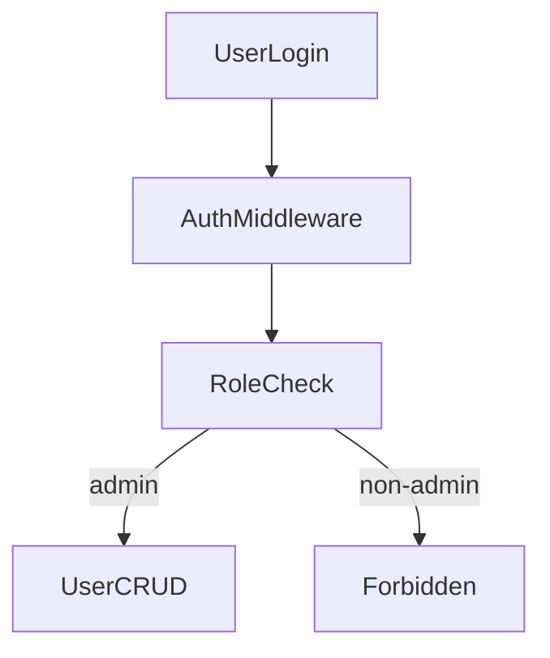

# Rencana CRUD User (Laravel Breeze + Spatie)

## Lingkup & asumsi

- Proyek menggunakan Laravel 12 + Breeze Blade.
- CRUD user di area admin/privileged (hanya role tertentu).
- Role/permission pakai `spatie/laravel-permission`.
- Fitur ekstra: avatar, status aktif, filter pencarian.

## Langkah implementasi

1. **Pasang Spatie & setup authz**

   - Install package, publish config/migration, jalankan migrasi.
   - Update `App\Models\User` untuk trait `HasRoles`.
   - Buat seeder role/permission awal (mis. `admin`, `staff`).
   - Tambah middleware/Policy untuk membatasi akses CRUD user.

2. **Schema & model perubahan**

   - Tambah kolom `avatar_path` dan `is_active` ke `users` migration baru.
   - Update `$fillable`/casts di `app/Models/User.php`.
   - Siapkan storage publik untuk avatar (pakai `storage:link`).

3. **Routing & controller CRUD**

   - Tambah resource route (mis. `Route::resource('users', UserController::class)`) di `routes/web.php` dalam middleware `auth` + `role:admin`.
   - Buat `UserController` untuk index/create/store/edit/update/destroy.
   - Gunakan Form Request untuk validasi create/update.

4. **View Blade (Breeze style)**

   - Buat view `resources/views/users/*` (index, create, edit, show optional).
   - Integrasi layout Breeze (`layouts.app`) dan komponen form.
   - Tambah UI filter (search by name/email, status, role), pagination.
   - Tambah upload avatar, toggle status aktif.

5. **Reset password admin**

   - Tambah aksi di edit user untuk reset password (generate random + email, atau manual input).
   - Reuse validator dari auth.

6. **Testing dasar**

   - Feature tests untuk: admin bisa CRUD, non-admin ditolak, upload avatar valid, status toggle.

## File utama yang disentuh

- `routes/web.php`
- `app/Http/Controllers/UserController.php`
- `app/Http/Requests/UserStoreRequest.php`
- `app/Http/Requests/UserUpdateRequest.php`
- `app/Models/User.php`
- `database/migrations/*_add_user_profile_fields.php`
- `database/seeders/RolePermissionSeeder.php`
- `resources/views/users/*.blade.php`
- `config/permission.php` (Spatie)

## Diagram alur akses (ringkas)

