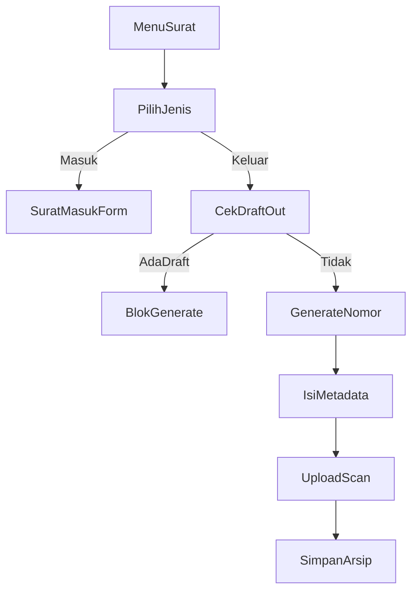

# Rencana Fitur Generate Nomor Surat

## Ringkasan flow

- Menu `Surat` → pilih `Surat Masuk` atau `Surat Keluar`.
- **Surat Keluar**: admin/user membuat definisi format nomor (sekali), lalu generate nomor berikutnya dari format tersebut. Setelah nomor dibuat, user wajib lengkapi data surat + upload scan sebelum bisa generate nomor berikutnya (lock per jenis surat).
- **Surat Masuk**: tidak generate nomor; hanya input metadata + upload scan.

## Desain data (tabel utama)

1. **`letter_formats`**: definisi format nomor surat per jenis surat.

   - kolom kunci: `id`, `type` (in/out), `name`, `description`.

2. **`letter_format_segments`**: segmen format (builder per-segmen).

   - kolom: `format_id`, `order`, `kind` (sequence, text, month_roman, year, unit_code, etc), `value` (opsional), `padding`.

3. **`letters`**: arsip surat (masuk/keluar).

   - kolom: `id`, `type`, `format_id` (nullable untuk masuk), `number`, `sequence`, `title`, `description`, `scan_path`, `status` (draft/complete), `issued_at`, `created_by`.

4. **`letter_counters`**: counter per format + tahun/bulan jika dibutuhkan.

   - kolom: `format_id`, `period` (YYYY atau YYYY-MM), `current_number`.

## Aturan bisnis utama

- **Lock per jenis**: jika ada surat terakhir berstatus `draft` pada jenis yang sama, tombol generate nomor nonaktif dan minta upload scan dulu.
- **Anti-duplicate**: `letters.number` unique per jenis surat.
- **Surat masuk**: tanpa format/sequence; hanya metadata + scan.

## Langkah implementasi

1. **Schema & model**

   - Tambah migrasi untuk `letter_formats`, `letter_format_segments`, `letters`, `letter_counters`.
   - Buat model relasi: `LetterFormat`, `LetterFormatSegment`, `Letter`, `LetterCounter`.

2. **Service generator nomor**

   - Buat service `LetterNumberGenerator` untuk:
     - compose nomor dari segmen,
     - update counter atomik,
     - cek lock draft per jenis.

3. **Routing & controller**

   - Tambah route menu `Surat Masuk` dan `Surat Keluar`.
   - CRUD format nomor (hanya keluar).
   - CRUD surat masuk (metadata + upload).
   - Generate surat keluar: create → generate nomor → isi metadata + upload → submit.

4. **UI Blade**

   - Halaman index surat masuk/keluar, form create, detail/edit.
   - UI builder segmen format (drag/drop ringan atau tabel urutan).
   - Tombol generate nomor di surat keluar dengan status lock.

5. **Storage & validation**

   - Upload scan PDF ke `storage/public/letters`.
   - Validasi file `pdf`, size limit.

6. **Testing dasar**

   - Test: lock per jenis, nomor unik, generate sequence, upload scan wajib sebelum generate berikutnya.

## File utama yang akan disentuh

- `routes/web.php`
- `app/Models/LetterFormat.php`
- `app/Models/LetterFormatSegment.php`
- `app/Models/Letter.php`
- `app/Models/LetterCounter.php`
- `app/Services/LetterNumberGenerator.php`
- `app/Http/Controllers/LetterOutController.php`
- `app/Http/Controllers/LetterInController.php`
- `resources/views/letters/*`
- `database/migrations/*_create_letter_*`

## Diagram flow (ringkas)

